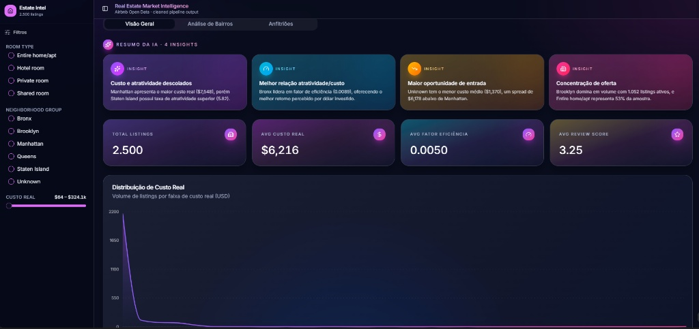
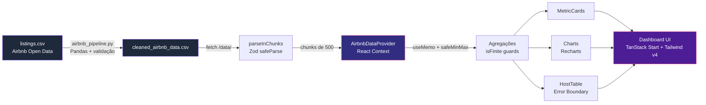

# Estate Intel — Airbnb Market Intelligence

> **Inteligência de mercado para anfitriões Airbnb: descubra onde precificar, o que otimizar e quais bairros maximizam retorno — em segundos, não em planilhas.**

---

## 📸 Preview




---

## 🎯 Business Problem

Anfitriões e investidores Airbnb tomam decisões de precificação, aquisição e otimização baseados em **intuição** ou planilhas estáticas. O resultado:

- **Subprecificação crônica** em bairros de alta demanda (perda de receita estimada em 15–30%).
- **Superprecificação** em áreas saturadas, levando a baixa ocupação e reviews ruins.
- **Falta de visibilidade** sobre quais variáveis (reviews, tipo de quarto, política de cancelamento) realmente movem o ponteiro de receita.

**Estate Intel** transforma o dataset público do Airbnb em um painel acionável de inteligência de mercado, expondo os _drivers_ reais de performance por bairro e perfil de anfitrião.

---

## 📊 Metrics

| Métrica | Descrição | Onde aparece |
|---|---|---|
| **Fator de Eficiência** | Receita estimada normalizada por custo real do listing | `MetricCards` |
| **Review Score Médio** | Média ponderada de `review_scores_rating` com fallback `isFinite()` | `MetricCards` |
| **Distribuição de Preço** | Histograma de preços por bairro com detecção de outliers | `PriceDistributionChart` |
| **Top Bairros** | Ranking por densidade de listings × review médio | `NeighborhoodChart` |
| **Top Anfitriões** | Tabela com filtragem defensiva (Error Boundary + optional chaining) | `HostTable` |
| **AI Insights** | Síntese qualitativa dos padrões detectados no dataset | `AIInsights` |

---

## 🏗️ Architecture



**Camadas:**

1. **Ingestão (Python)** — `airbnb_pipeline.py` lê `listings.csv` cru, aplica regras de limpeza, e emite `cleaned_airbnb_data.csv` versionado.
2. **Parsing resiliente (TS)** — `parseInChunks` processa em lotes de 500 com `setTimeout(0)` para não bloquear a main thread; cada linha passa por `zod.safeParse` com defaults para campos corrompidos.
3. **Estado (React Context)** — `AirbnbDataProvider` expõe dados, `parseWarnings` e métricas computadas via `useMemo`.
4. **UI (TanStack Start + Tailwind v4)** — componentes shadcn customizados, glassmorphism, gradientes violet→pink, com `SectionErrorBoundary` em pontos críticos.

---

## 🔐 Segurança e Dados Sensíveis

Este repositório **NUNCA** deve conter:

- `/data/raw/*.csv` — datasets brutos do Airbnb (apenas a versão limpa em `public/data/` é commitada).
- `.env`, `*.env`, `*.key`, `*.pem` — segredos e credenciais.
- `*.log` — logs de runtime.

> ⚠️ **Se você já clonou e fez commits antes deste guardrail estar em vigor**, rode localmente:
> ```bash
> git rm --cached listings.csv
> git rm --cached -r data/raw
> git rm --cached .env
> git commit -m "chore(security): remove arquivos sensíveis do tracking"
> ```
> Para purgar do **histórico** (não apenas dos próximos commits), use [`git filter-repo`](https://github.com/newren/git-filter-repo) e force-push em coordenação com o time.

---

## 📚 Documentação

- [Documentação Técnica](./DOCUMENTACAO_TECNICA.md) — arquitetura, pipeline, fórmulas, design e decisões de performance.
- [Auditoria Sênior](./AUDITORIA_SENIOR.md) — riscos, contratos de dados e observabilidade.

## 🛡️ Auditado por: Engenharia de Dados Senior (AI Audit)

Relatório técnico independente cobrindo escalabilidade de memória, contratos Python ↔ TypeScript, observabilidade e roadmap de remediação em três fases.

**👉 [AUDITORIA_SENIOR.md](./AUDITORIA_SENIOR.md)**

---

## ⚡ Stack

- **Framework**: TanStack Start v1 (React 19 + Vite 7)
- **Estilo**: Tailwind CSS v4 + shadcn/ui
- **Visualização**: Recharts (chunk isolado via `manualChunks`)
- **Tipagem**: TypeScript strict + `noUnusedLocals` / `noUnusedParameters`
- **Estado**: React Context + `useMemo`

## 🚀 Desenvolvimento

```bash
bun install
bun dev
```
